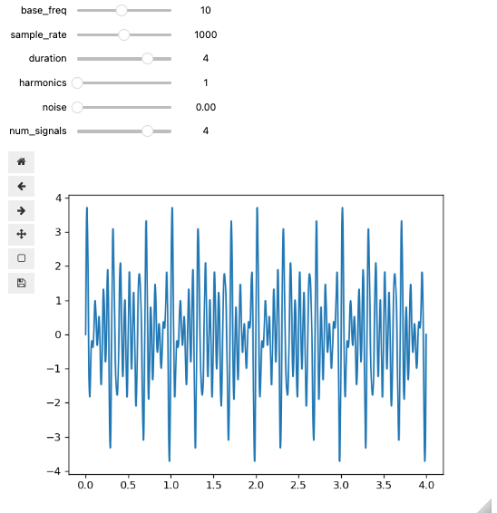

# Dimensionally Aligned Signal Projection (DASP)

[](https://github.com/psf/black)

## Table of Contents

1. [Summary](#summary)
2. [Installation](#installation)
3. [Testing](#testing)
4. [Features/Usage](#features--usage)
    * [DASP Algorithms](#dasp-algorithms)
    * [Visualizations](#visualization-functions)
    * [Other Functions](#other-functions)

## Summary
Dimensionally aligned signal projection (DASP) algorithms are used to analyze fast Fourier transforms (FFTs) and generate visualizations that help focus on the harmonics for specific signals. At a high level, these algorithms extract the FFT segments around each harmonic frequency center, and then align them in equally sized arrays ordered by increasing distance from the base frequency. This allows for a focused view of the harmonic frequencies, which, among other use cases, can enable machine learning algorithms to more easily identify salient patterns. This work seeks to provide an effective open-source implementation of the DASP algorithms as well as functionality to help explore and test how these algorithms work with an interactive dashboard and signal-generation tool.

The DASP library is implemented in Python and contains four types of algorithms for implementing these feature engineering techniques: fixed harmonically aligned signal projection (HASP), decimating HASP, interpolating HASP, and frequency aligned signal projection (FASP). Each algorithm returns a numerical array, which can be visualized as an image. For consistency FASP, which is the terminology used for the short-time Fourier transform, has been implemented as part of the library to provide a similar interface to the STFT of the raw signal. Additionally, the library contains an algorithm to generate artificial signals with basic customizations such as the base frequency, sample rate, duration, number of harmonics, noise, and number of signals.

Finally, the library provides multiple interactive visualizations, each implemented using IPyWidgets and work in a Jupyter environment. A dashboard-style visualization is provided, which contains some common signal-processing visual components (signal, FFT, spectogram) updating in unison with the HASP functions (see screenshot in [Visualizations](#visualization-functions)). Seperate from the dashboard, an independent visualization is provided for each of the DASP algorithms as well as the artifical signal generator. These visualizations are included in the library to aid in developing an intuitive understanding how the algorithms are affected by different input signals and parameter selections.

A detailed breakdown of how these algorithms work can be seen in 'example/algorithm_walkthrough'

## Installation
```python
pip install dasp-stacker
```

## Testing
```
pytest
```

## Contributing
See [CONTRIBUTING.md](CONTRIBUTING.md)

## Features / Usage

Here are some of the main features of the dasp-stacker library:
* Numerical array output for each algorithm (FASP, Fixed HASP, Decimating HASP, Interpolating HASP).
* Dashboard-style interactive visualization of HASP output alongside other, more common, signal visualization methods.
* Custom sine wave generator.
* Interactive visualization for FASP only.
* Interactive visualization for HASP algorithms (selecting one at a time).
* Interactive visualization for sine wave generation.

The features of this library can be thought of as 2 seperate sections. One being simple to use functions to provide raw output of the DASP algorithms, which is the main functionality. As an added set of features, several visualizations are provided to help develop an intuitive understanding of the HASP algorithms, as well as an interactive signal generation function.

The following sections are a breakout of the recommended usage for the available features of the dasp-stacker library. An example of actual function calls, along with the output, can be seen in 'examples/dasp_example_notebook.ipynb'.

### DASP Algorithms
<hr>

#### `fasp()` - Frequency Aligned Signal Projection
Generates an STFT.

##### Parameters

* signal (np.ndarray): The raw time domain signal.
* num_ffts (int): Number of fft slices within the STFT.
* use_row_norm (bool): Whether to normalize across each FFT individually.
* use_im_norm (bool): Whether to normalize the entire image.

##### Returns
* The FASP array -- a 2D NumPy array.

##### Example Usage

    fasp(signal=signal, num_ffts=np.floor(np.sqrt(signal.size / 2)), use_row_norm=True, use_im_norm=True)

#### `hasp_fixed()` - Fixed Harmonically Aligned Signal Projection
Fixed Harmonically Aligned Signal Projection generates a HASP array, using a fixed bandwidth around the frequency center.

##### Parameters
* sample_rate (int): Rate at which the the raw time domain signal was acquired or generated, as samples per second.
* fft (np.ndarray): The Fast Fourier Transform of the signal.
* bandwidth (int): How many hertz to include around the frequency center.
* freq_center: The frequency center of the raw time domain signal, in hertz.
* use_row_norm (bool): Whether to normalize across each FFT individually.
* use_im_norm (bool): Whether to normalize the entire final image.
* max_harmonics: The upper limit of harmonics to include in final HASP array.

##### Returns
* The fixed HASP array -- a 2D NumPy array.

##### Example Usage

```python
hasp_fixed(
    sample_rate=10_000,
    fft=fft,
    bandwidth=1_000,
    freq_center=1_000,
    use_row_norm=True,
    use_im_norm=True,
)
```

#### `hasp_decim()` - Decimating Harmonically Aligned Signal Projection
Decimating Harmonically Aligned Signal Projection generates a HASP array, allowing bandwidth around the frequency center to grow as the harmonics increase before downsampling each row to the minimum bandwidth size.

##### Parameters
* sample_rate (int): Rate at which the the raw time domain signal was acquired or generated, in samples per second.
* fft (np.ndarray): The Fast Fourier Transform of the signal.
* bandwidth (int): How many hertz to include around the frequency center.
* freq_center: The frequency center of the raw time domain signal, in hertz.
* use_row_norm (bool): Whether to normalize across each FFT individually.
* use_im_norm (bool): Whether to normalize the entire final image.
* max_harmonics: The upper limit of harmonics to include in final HASP array.

##### Returns:
* The decimating HASP array -- a 2D NumPy array.

##### Example Usage
```python
hasp_decim(
    sample_rate=10_000,
    fft=fft,
    bandwidth=1_000,
    freq_center=1_000,
    use_row_norm=True,
    use_im_norm=True,
)
```
#### `hasp_interp()` - Interpolating Harmonically Aligned Signal Projection
Interpolating Harmonically Aligned Signal Projection generates a HASP array, allowing bandwidth around the frequency center to grow as the harmonics increase before upsampling each row to the maximum bandwidth size.

##### Parameters
* sample_rate (int): Rate at which the the raw time domain signal was acquired or generated, as samples per second.
* fft (np.ndarray): The Fast Fourier Transform of the signal.
* bandwidth (int): How many hertz to include around the frequency center.
* freq_center (int): The frequency center of the raw time domain signal, in hertz.
* use_row_norm (bool): Whether to normalize across each FFT individually.
* use_im_norm (bool): Whether to normalize the entire final image.
* max_harmonics (int): The upper limit of harmonics to include in final HASP array.

##### Returns
* The interpolating HASP array -- a 2D NumPy array.

##### Example Usage
```python
hasp_interp(
    sample_rate=10_000,
    fft=fft,
    bandwidth=1_000,
    freq_center=1_000,
    use_row_norm=True,
    use_im_norm=True,
    )
```

### Visualization Functions

All visualizations are designed to display inside of a jupyter notebook.

#### `HASP_dash()` - HASP Dashboard
Creates a dashboard of the signal, spectogram, FFT, and HASP output.

This dashboard generates a signal based on the given input and does not accept external signals.
The purpose of this visualization is to provide common signal visualizations alongside the HASP
results to demonstrate how a variety of parameters effect the HASP algorithm.

##### Parameters

* base_freq (int): The base frequency of the sine wave, in hertz
* sample_rate (int): The sample rate of the sine wave as sample per second
* duration (int): The duration of the sine wave, in seconds.
* noise (float): The level of noise to add to the sine wave.
* wave_type (string): The type of sine wave to generate ('base', 'square', 'sawtooth', or 'triangle').
* bandwidth (int): The bandwidth around the frequency center to use for the HASP algorithm. To prevent overlap with other harmonics, this value cannot be larger than the base frequency.
* num_signals (int): The number of signals to add as part of the same sine wave.
* harmonics (int): The number of harmonics to include in the signal (default=0).

There are additional interactive parameters that are within the visualization that are only for the HASP algorithm, including the selection of which HASP algorithm to use, whether to use row normalization, image normalization, and image scaling, as well as adjustable sliders for the frequency center and bandwidth. These are only edittable within the dashboard.

##### Returns
* An ipywidget.

##### Example Usage
```python
HASP_dash(base_freq = 100, sample_rate = 2000, duration = 1, noise = 0, bandwidth = 50, num_signals=1)
```


#### `fasp_viz()` FASP Interactive Visualization
Displays the FASP visualization for the provided signal.

##### Parameters
* raw_signal (np.ndarray): The raw time domain signal
* num_ffts (int): Number of FFT slices within the STFT, determined by calculation if not provided.
* color_map (string): The colormap of the image, defaults to "plasma" if none provided.

Whether to use row normalization, image normalization, and color map selection are able to be editted in real time within the visualization.

##### Returns
* An ipywidget.

##### Example Usage
```python
fasp_viz(raw_signal=signal)
```


#### `hasp_viz()` HASP Interactive Visualization
Displays the HASP visualization for the provided signal. The user can select which version of HASP to use within the visualization.

##### Parameters
* signal (np.ndarray): The input signal to visualize.
* freq_center (int): The frequency center of the input signal.
* sample_rate (int): The sample rate of the input signal.

There are additional interactive parameters that are only edittable within the visualization, including:
* The selection of which HASP algorithm to use
* Whether to use row normalization, image normalization, and image scaling
* Adjustable sliders for the frequency center and bandwidth.

##### Returns
* An ipywidget.

##### Example Usage
```python
hasp_viz(signal = signal, freq_center = 100, sample_rate=1_000)
```


### Other Functions

#### `sine_wave_creator()` - Custom Sine Wave Generator
Creates a sine wave signal with specified characteristics.

##### Parameters
* base_freq (int): The base frequency of the sine wave.
* sample_rate (int): The sample rate of the sine wave.
* duration (int): The duration of the sine wave.
* noise (float): The level of noise to add to the sine wave.
* wave_type (string): The type of sine wave to generate ('base', 'square', 'sawtooth', or 'triangle').
* num_signals (int): The number of signals to add as part of the same sine wave.
* harmonics (int): The number of harmonics to include in the signal (default=0).

##### Returns
* out_signal: The generated sine wave signal.
* time: The associated time array of the generated signal.

##### Example Usage
```python
signal, time = sine_wave_creator(
    base_freq=100,
    sample_rate=1_000,
    duration=1,
    wave_type="base",
    num_signals=2,
    noise=.5,
)
```

#### `sig_viewer()` - Custom Sine Wave Interactive Visualization
Generates a signal based on the given inputs and creates an interactive visualization, allowing the user to adjust parameters and see how they effect the signal.

##### Parameters
* base_freq (int): The base frequency of the signal, in hertz
* sample_rate (int): The sample rate of the signal, in sample per second
* duration (int): The duration of the signal, in seconds
* harmonics (int): The number of harmonics in the signal.
* wave_type (string): The type of sine wave to generate ('base', 'square', 'sawtooth', or 'triangle').
* num_signals (int): The number of signals to add as part of the same sine wave.

##### Returns
* None

##### Example Usage
```python
sig_viewer(
    base_freq=10,
    sample_rate=1000,
    duration=1,
    harmonics=0,
    wave_type="base",
    num_signals=4,
)
```

