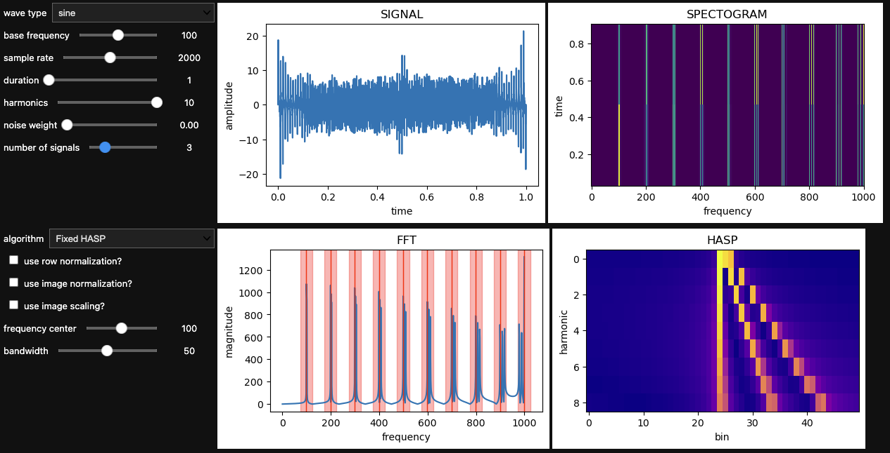
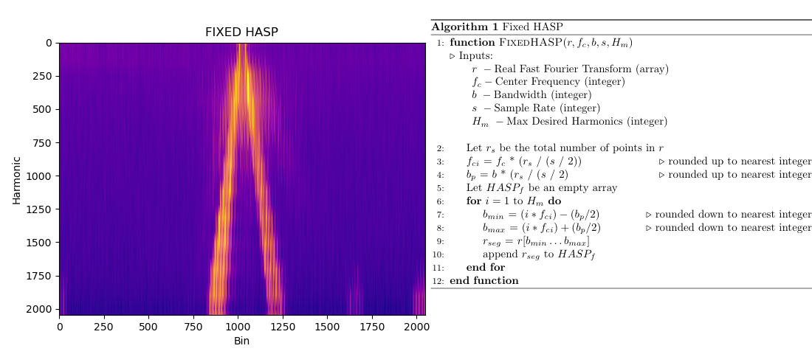
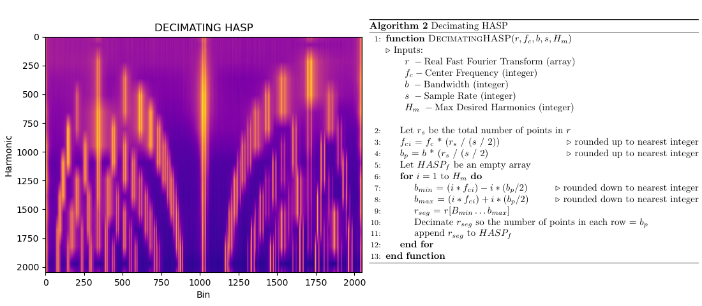
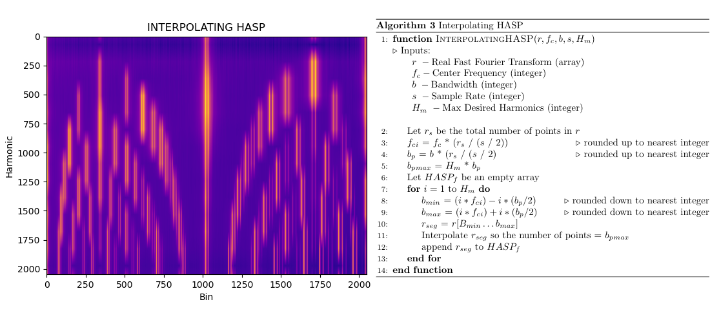
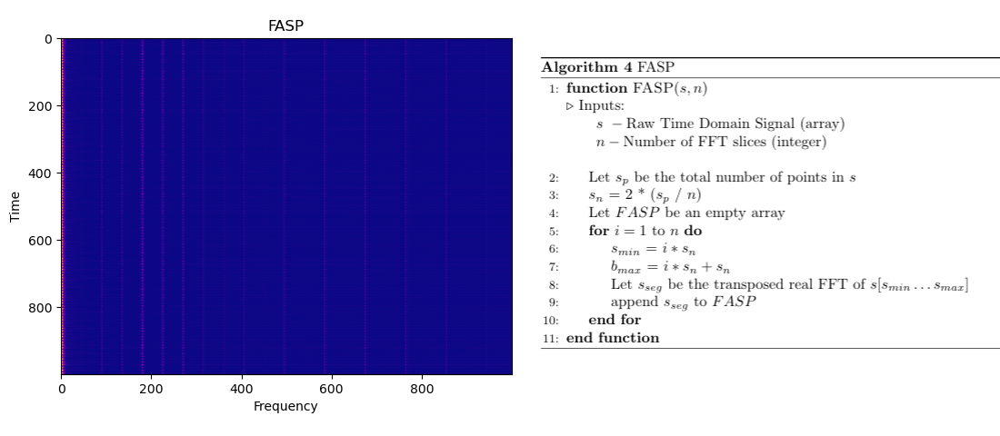

# Summary

Dimensionally aligned signal projection (DASP) algorithms are used to analyze fast Fourier transforms (FFTs) and generate visualizations that help focus on the harmonics for specific signals. At a high level, these algorithms extract the FFT segments around each harmonic frequency center, and then align them in equally sized arrays ordered by increasing distance from the base frequency. This allows for a focused view of the harmonic frequencies, which, among other use cases, can enable machine learning algorithms to more easily identify salient patterns. This work seeks to provide an effective open-source implementation of the DASP algorithms proposed by @7907255 as well as functionality to help explore and test how these algorithms work with an interactive dashboard and signal-generation tool.

The DASP library is implemented in Python and contains four types of algorithms for implementing these feature engineering techniques: fixed harmonically aligned signal projection (HASP), decimating HASP, interpolating HASP, and frequency aligned signal projection (FASP). Each algorithm returns a numerical array, which can be visualized as an image. The HASP algorithms are variations of the algorithms originally presented by @7907255. For consistency, FASP, which is the terminology used for the short-time Fourier transform (STFT), has been implemented as part of the library to provide a similar interface to the STFT of the raw signal. Additionally, the library contains an algorithm to generate artificial signals with basic customizations such as the base frequency, sample rate, duration, number of harmonics, noise, and number of signals.

Finally, the library provides multiple interactive visualizations, each of which is implemented using IPyWidgets and works in a Jupyter environment. A dashboard-style visualization is provided, which contains some common signal-processing visual components (signal, FFT, spectogram) updating in unison with the HASP functions (see Figure 1 below). Separate from the dashboard, an independent visualization is provided for each of the DASP algorithms as well as for the artifical signal generator. These visualizations are included in the library to aid in developing an intuitive understanding how the algorithms are affected by different input signals and parameter selections.

 

# Statement of Need

Signals analysis in problem domains such as nonintrusive load monitoring often requires subject matter experts to create highly specific signal transforms for the target devices under test. The DASP algorithms were originally created as a feature-engineering technique to emphasize the harmonics present in a signal. This added emphasis has been shown to improve the performance of models that classify the type of downstream device(s) in noninstrusive load monitoring (NILM) applications [@7907255].

Although the DASP algorithms have proven useful for signal-feature extraction, at the time of this writing few open-source libraries focus on harmonic-structure extraction and manipulation. NILMTK [@batra2014nilmtk] provides an expansive library for preprocessing and analyzing NILM-specific data but has no functionality for harmonics. TorchSig [@boegner2022large] is a machine learning toolkit for manipulating signals in PyTorch and has an expansive array of signal transforms and augmentations but also has nothing specific to harmonic structure. An implementation of an algorithm using average harmonic structure to extract notes of specific instruments from audio data [@4469889] exists [@cpvlordelo], but this algorithm focuses on learning harmonic models of specific instruments rather than as a general feature-engineering technique.


# Algorithm Details

This section describes technical details of each algorithm included in the DASP library, shows an example figure of the output using a data sample which collected the electromagnetic spectrum around two fluorescent lightbulbs at a sample rate of 2 megasamples per second, and provides pseudocode for the general structure of the algorithm.

## Harmonically Aligned Signal Projection
Each HASP algorithm follows the general structure of first calculating the appropriate step size to locate the index of each harmonic center, extracting the value at each index (harmonic center) along with an equal number of adjacent points from each side, and then unioning these equally sized segments before outputting them as one HASP array.

### Fixed
Fixed HASP groups each harmonic center with its surrounding points using a fixed number of points. See Figure 2 below.



### Decimating
Decimating HASP groups each harmonic center with its surrounding points, allowing the number of points to grow as the harmonics (and frequency) increase, and then decimates each harmonic (row) to be equal to the number of points in the row with the lowest frequency (and by extension the smallest number of points). See Figure 3 below.



This version of the algorithm increases resolution at lower harmonics.

### Interpolating
Interpolating HASP groups each harmonic center with its surrounding points, allowing the number of points to grow as the harmonics (and frequency) increase, and then interpolates each harmonic (row) to be equal to the number of points in the highest frequency (and by extension the largest row). See Figure 4 below.



This version of the algorithm increases resolution at higher harmonics.

## Frequency Aligned Signal Projection
FASP simply creates a spectogram of the input signal. See Figure 5 below.
<!--
::: {exclude-in="jats"}

\begin{figure}[!htb]
    \centering
    \begin{minipage}{.56\textwidth}
    \end{minipage}
\end{figure}

:::

```{=jats}
<fig>
  <caption><p>Decimating HASP image of 2 flourescent lightbulbs:
  base frequency 45,033, sample rate 2,000,000</p></caption>
  <graphic mimetype="image" mime-subtype="png" xlink:href="media/decimating_hasp_flourescent.png" />
</fig>
<fig>
  <caption><p>Decimating HASP image of 2 flourescent lightbulbs:
  base frequency 45,033, sample rate 2,000,000</p></caption>
  <graphic mimetype="image" mime-subtype="png" xlink:href="media/decimating_hasp_flourescent.png" />
</fig>
```

-->



# Audience

The target audience for a DASP algorithms library is researchers, data scientists, and engineers in the field of signal processing who want to use machine learning as a tool for identifying patterns in signals.

This open-source software is licensed under a BSD-3 clause license, is registered on [DOE Code](https:// doi:10.11578/dc.20220208.1), and is available on [GitHub](https://github.com/ORNL/dasp-stacker). The package is also pip installable with ``pip install dasp-stacker``. Finally, linting for this project is performed using black [@black-linter] and flake8 [@flake8] as well as other pre-commit hooks with pre-commit [@precommit].

# Acknowledgements

The authors would like to acknowledge the US Department of Energy, National Nuclear Security Administration's Office of Defense Nuclear Nonproliferation Research and Development (NA-22) for supporting this work.

This manuscript has been authored by UT-Battelle, LLC, under contract DE-AC05-00OR22725 with the US Department of Energy (DOE). The US government retains and the publisher, by accepting the article for publication, acknowledges that the US government retains a nonexclusive, paid-up, irrevocable, worldwide license to publish or reproduce the published form of this manuscript, or allow others to do so, for US government purposes. DOE will provide public access to these results of federally sponsored research in accordance with the DOE Public Access Plan (http://energy.gov/downloads/doe-public-access-plan).

# References
